# Bedrock Chat データフロー分析

## 1. 概要

Bedrock Chatアプリケーションにおけるデータの流れを分析し、エンドツーエンドのデータフローを理解します。このドキュメントでは、ユーザーの入力からAIの応答生成、データの保存までの一連の流れを説明します。

## 2. 主要なデータフローパターン

Bedrock Chatには、以下の主要なデータフローパターンがあります：

1. **チャットメッセージのデータフロー**: ユーザー入力からAI応答までの流れ
2. **ボット管理のデータフロー**: ボットの作成、更新、共有の流れ
3. **知識ベース（RAG）のデータフロー**: ドキュメントのアップロードから埋め込み、検索までの流れ
4. **エージェント機能のデータフロー**: ツール使用のリクエストから結果の表示までの流れ
5. **認証・認可のデータフロー**: ユーザー認証と権限管理の流れ

## 3. チャットメッセージのデータフロー

### 3.1 基本的なチャットフロー

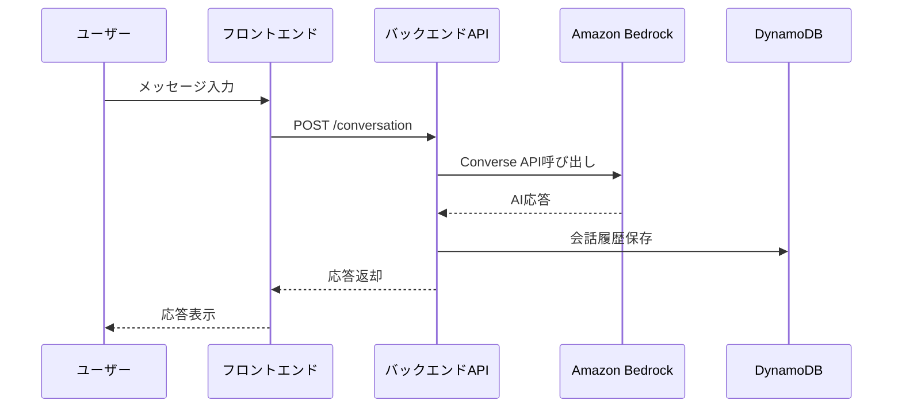

### 3.2 ストリーミングチャットフロー

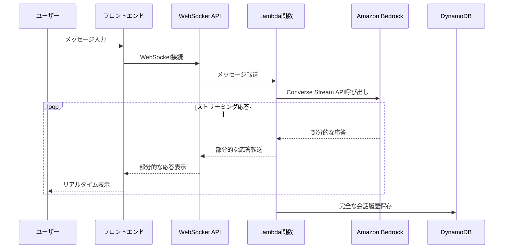

### 3.3 データ構造の変換

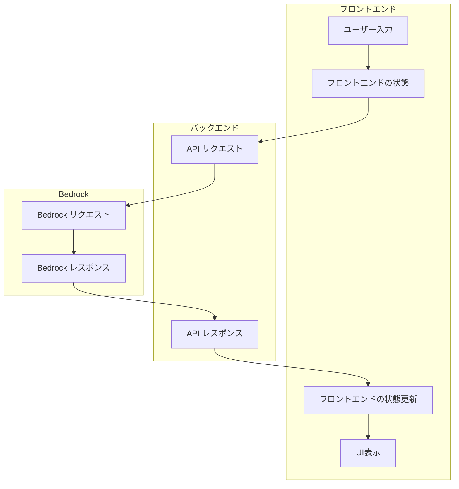

## 4. ボット管理のデータフロー

### 4.1 ボット作成フロー

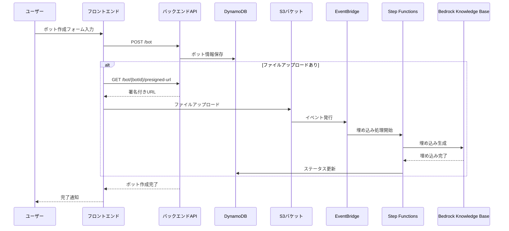

### 4.2 ボット共有フロー

```mermaid
flowchart TD
    A[ボット所有者] --> B[共有設定変更]
    B --> C[API: PATCH /bot/{botId}/visibility]
    C --> D[DynamoDB更新]
    D --> E[共有ステータス変更]
    
    F[他のユーザー] --> G[ボットストア閲覧]
    G --> H[API: GET /store/search または /store/popular]
    H --> I[共有ボット一覧取得]
    I --> J[ボット使用]
    J --> K[エイリアス作成]
    K --> L[DynamoDBにエイリアス保存]
```

## 5. 知識ベース（RAG）のデータフロー

### 5.1 ドキュメント処理フロー

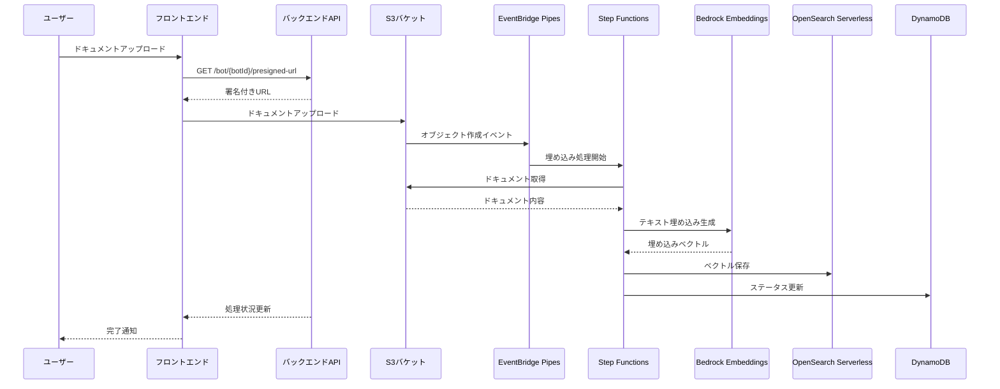

### 5.2 RAG検索フロー

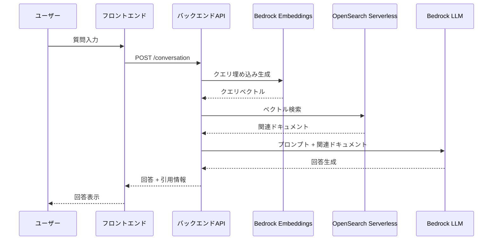

## 6. エージェント機能のデータフロー

### 6.1 エージェントツール使用フロー

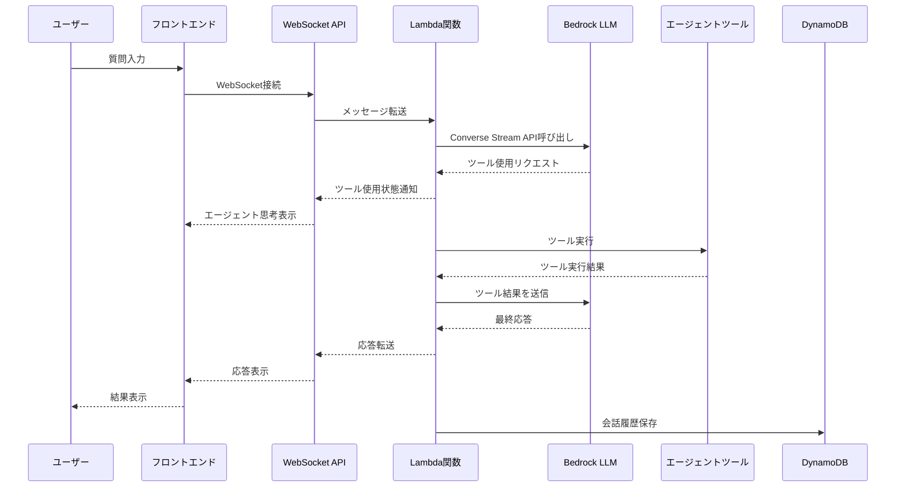

### 6.2 エージェント状態遷移

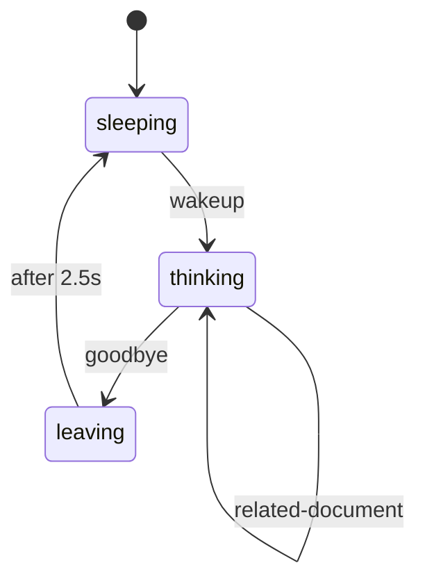

## 7. 認証・認可のデータフロー

### 7.1 認証フロー

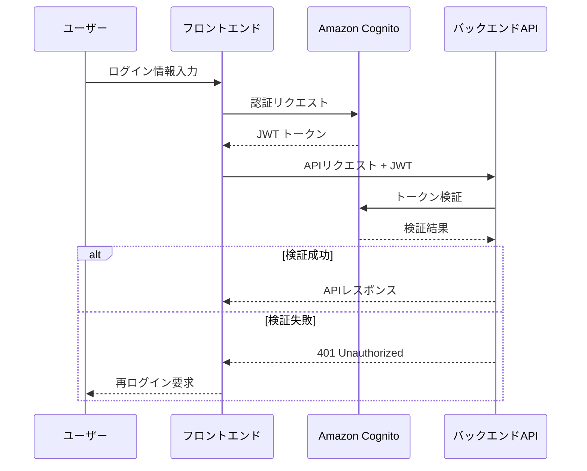

### 7.2 権限管理フロー

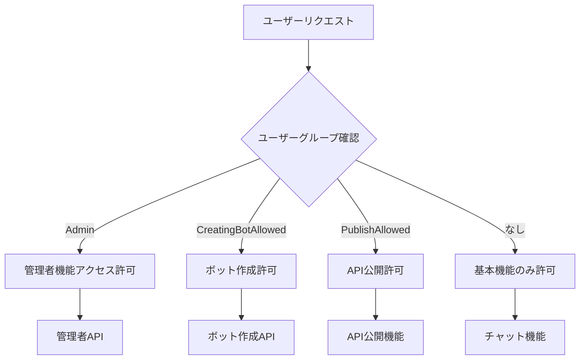

## 8. エンドツーエンドのデータフロー

### 8.1 RAGを使用したチャットの完全なフロー

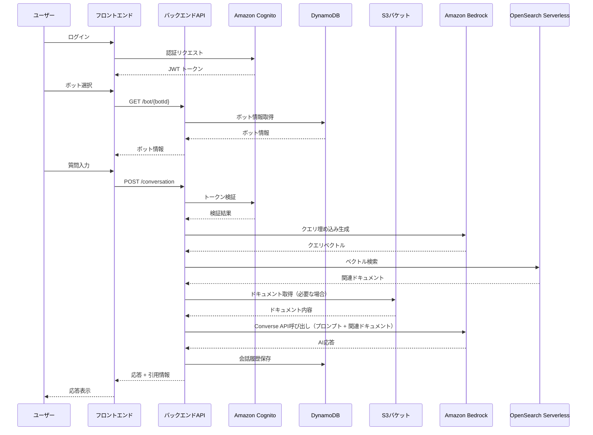

### 8.2 エージェント機能を使用したチャットの完全なフロー

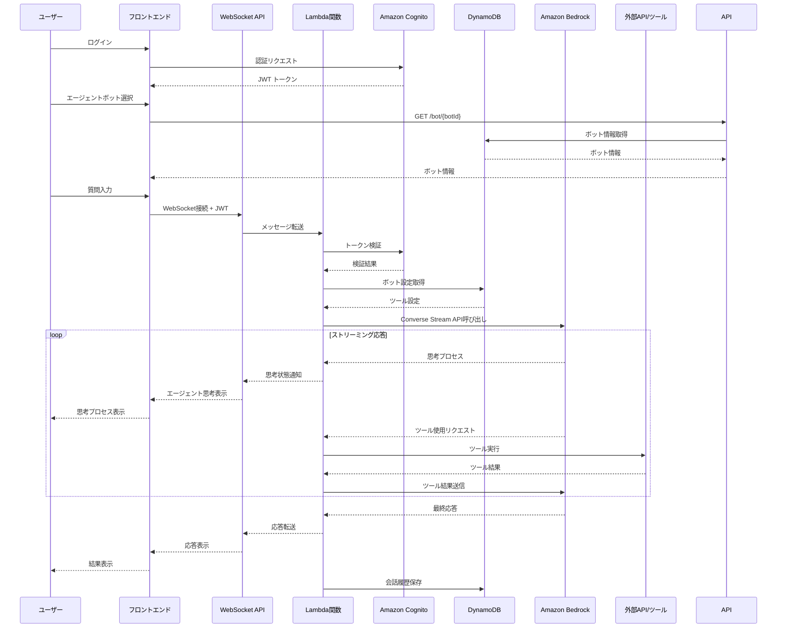

## 9. データの永続化と状態管理

### 9.1 データ永続化の流れ

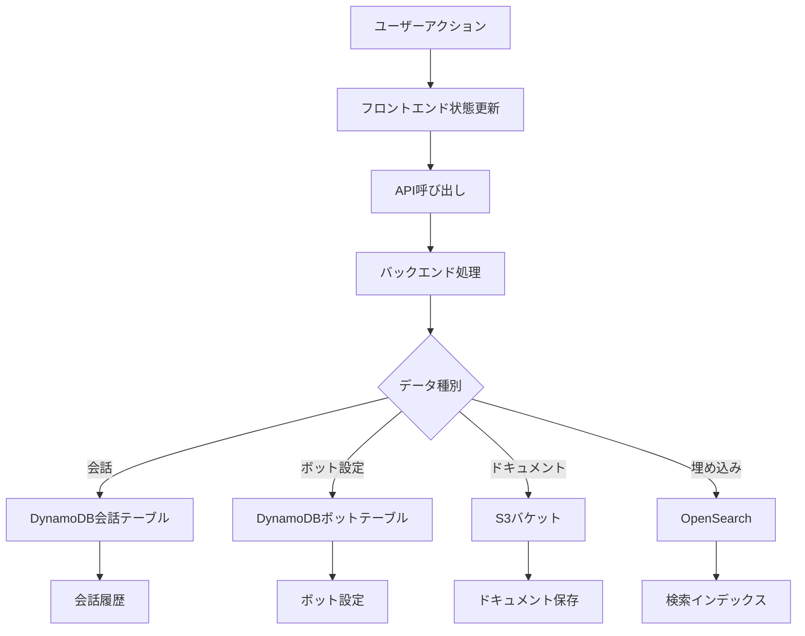

### 9.2 フロントエンド状態管理の流れ

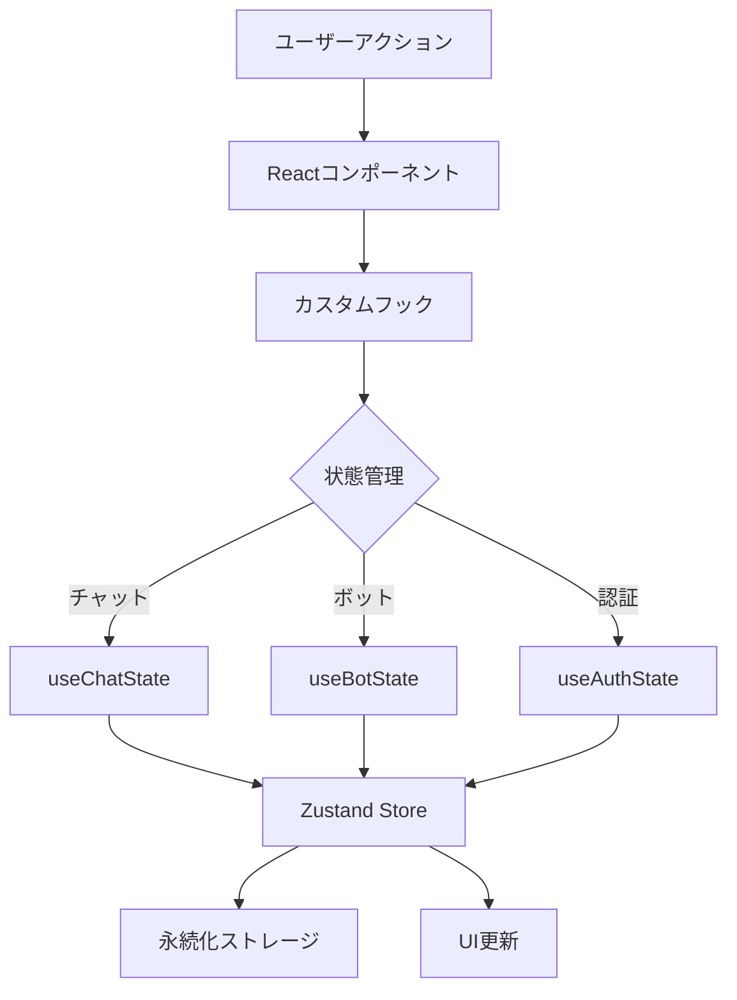

## 10. エラーハンドリングとリカバリーフロー

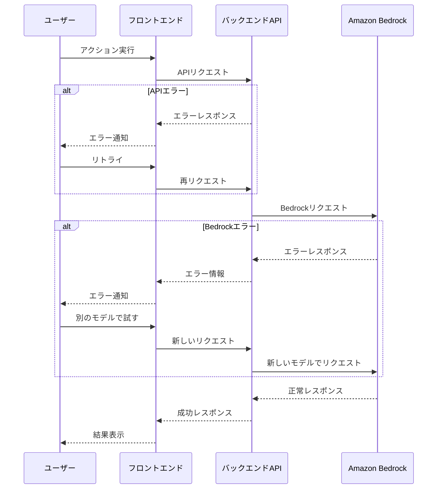

## 11. まとめ

Bedrock Chatアプリケーションのデータフローは、以下の特徴を持っています：

1. **多層アーキテクチャ**: フロントエンド、バックエンドAPI、AWSサービスの多層構造
2. **イベント駆動型処理**: EventBridge PipesとStep Functionsによる非同期処理
3. **リアルタイム通信**: WebSocketを使用したストリーミングレスポンス
4. **状態の分離**: フロントエンドとバックエンドでの明確な状態管理
5. **マイクロサービス的アプローチ**: 機能ごとに分離された処理フロー

これらのデータフローパターンにより、Bedrock Chatは拡張性が高く、保守性の良いアーキテクチャを実現しています。特に、RAG機能とエージェント機能のデータフローは、複雑な処理を効率的に実行するために最適化されています。
